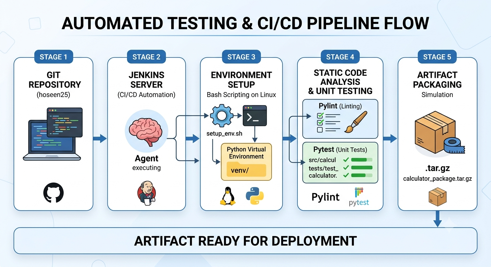

\# 🚀 Automated Testing \& CI/CD Pipeline





A production-ready Continuous Integration (CI) pipeline designed to automate environment setup, static code analysis (linting), and unit testing for a Python-based application. 


This project demonstrates core DevOps principles, infrastructure automation, and software quality assurance using industry-standard tools.


\---


\## 🏗️ Architecture \& Pipeline Flow


The pipeline is built around a declarative Jenkins architecture and follows these automated stages:


1\. \*\*Environment Setup:\*\* A Linux Bash script (`setup\_env.sh`) dynamically provisions a Python Virtual Environment (`venv`) and installs required dependencies.

2\. \*\*Code Linting:\*\* Static code analysis is performed using `pylint` to enforce PEP 8 style guides and catch potential bugs early.

3\. \*\*Automated Testing:\*\* Robust unit tests and edge cases are executed using `pytest`.

4\. \*\*Artifact Simulation:\*\* Upon successful validation, the application is packaged into a deployment-ready tarball (`.tar.gz`).


\---


\## 🛠️ Tech Stack \& Tools


\* \*\*CI/CD Automation:\*\* Jenkins (Declarative Pipeline written in \*\*Groovy\*\*)

\* \*\*Programming Language:\*\* Python 3

\* \*\*Testing Framework:\*\* `pytest`

\* \*\*Static Code Analysis (Linter):\*\* `pylint`

\* \*\*Scripting \& OS:\*\* Linux Bash Shell Scripting


\---


\## 📂 Project Structure


```text

Automated-Testing-CICD-Pipeline/

├── .gitignore               # Excludes virtual envs and test caches from Git

├── Jenkinsfile              # Groovy script defining the CI pipeline stages

├── README.md                # Project documentation (You are here)

├── requirements.txt         # Project dependencies (pytest, pylint)

├── setup\_env.sh             # Linux Bash script for automated environment setup

├── src/

│   └── calculator.py        # Core application logic (Calculator Class)

└── tests/

&#x20;   └── test\_calculator.py   # Automated unit tests and edge cases

